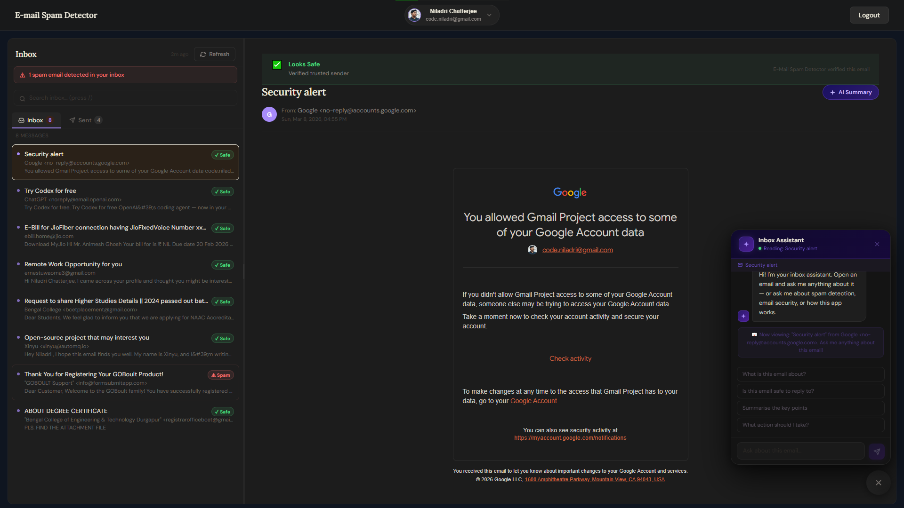

# 📬 E-Mail Spam Detector — AI-Powered Gmail Client

> A full-stack Gmail client that reads your inbox, detects spam in real time, summarises emails with AI, and gives you an intelligent chatbot assistant — all while keeping your data completely private.

<div align="center">
  

[**🌐 Live Website**](https://spam-detector1.vercel.app)

</div>

---

## Why This is Better Than Reading Gmail Directly

| Feature                    | Gmail                   | This App                                                   |
| -------------------------- | ----------------------- | ---------------------------------------------------------- |
| Spam detection explanation | ❌ Hidden black box     | ✅ Exact reason shown for every flag                       |
| Inbox health score         | ❌ None                 | ✅ % health score with donut chart                         |
| AI email summary           | ❌ None                 | ✅ One-click Gemini 2.5 Flash bullet-point summary         |
| AI chatbot assistant       | ❌ None                 | ✅ Ask anything about any open email                       |
| Dark / custom themes       | Limited                 | ✅ 6 themes, 6 accent colours, 3 font sizes                |
| Keyboard navigation        | Partial                 | ✅ `j`/`k` scroll, `/` search, `r` refresh                 |
| Instant search             | Server-side, slow       | ✅ Client-side, instant, zero network calls                |
| Spam analytics             | ❌ None                 | ✅ Charts, spam rate, top signal reasons                   |
| Data privacy               | Google reads everything | ✅ Email content never stored — processed live, in memory  |
| Spam signal transparency   | ❌ None                 | ✅ "Phishing link detected", "Lottery scam keywords", etc. |

---

## Features

### 🛡️ Real-Time Spam Detection

Every inbox email is classified the moment it loads — no waiting, no extra clicks. The rule-based engine checks:

- **Trusted domain whitelist** — 100+ verified senders (Google, Microsoft, Amazon, Indian banks like SBI/HDFC/ICICI, Zomato, Swiggy, etc.) → instant safe
- **Known spam domains** — throwaway mail services → instant spam
- **Suspicious TLDs** — `.xyz`, `.tk`, `.click`, `.loan`, `.win`, `.gq`
- **Subject keywords** — 15 pattern categories: lottery, phishing, crypto, fake delivery, urgency tactics, prize notifications
- **Snippet/body patterns** — credential harvesting, fake account threats, dollar-amount lures
- **Structural signals** — all-caps subject, excessive punctuation/emoji, raw IP sender, numeric-only accounts

Every result includes a human-readable reason so you know exactly _why_ something was flagged.

---

### 🤖 AI Email Summariser (Gemini 2.5 Flash)

Open any email → click **AI Summary** → get 3–5 focused bullet points covering the main purpose, action items, deadlines, and key info. HTML is stripped server-side before sending to Gemini. The API key stays on the backend — never exposed to the browser.

---

### 💬 Intelligent Inbox Chatbot

A floating chat assistant in the bottom-right corner. It knows the full context of whichever email you have open — subject, sender, date, body content, and its spam scan result. Switch emails and the chatbot automatically picks up the new context. Ask things like:

- _"Is this safe to reply to?"_
- _"What is this email asking me to do?"_
- _"Why was this flagged as spam?"_
- _"Summarise the key points"_

The bot also answers general questions about how the app works, spam detection rules, and email security best practices.

---

### 📊 Inbox Health Dashboard

Navigate to **Results** for a full inbox analysis:

- Donut chart with Excellent / Good / Fair / Poor / Critical rating
- Stats grid: Total, Safe, Spam, Scanned counts
- Spam rate progress bar
- Top 5 spam signal reasons with ranked bar charts
- Personalised health tip based on your spam rate

---

### ⚙️ Full Customisation (Settings Page)

All changes apply live with instant preview — no save needed to see the effect:

- **6 Themes:** Dark, Midnight, Warm, Forest, Ocean, Rose
- **6 Accent Colours:** Orange, Green, Blue, Pink, Amber, Purple
- **3 Font Sizes:** Small, Medium, Large
- Compact mode toggle
- Email snippet toggle

---

### ⚡ Performance

Emails are fetched **once** on load and cached globally for 5 minutes via React Context. Navigating between Dashboard, Results, Account, and Settings is instant — zero additional API calls. A manual **Refresh** button forces a new fetch and re-scan when you need it.

---

## Tech Stack

| Layer           | Technology                           | Why                                         |
| --------------- | ------------------------------------ | ------------------------------------------- |
| Frontend        | React 18 + Vite                      | Fast HMR, clean component model             |
| Routing         | React Router v6                      | SPA navigation, no page reloads             |
| HTTP Client     | Axios + interceptors                 | Auto-attaches JWT to every request          |
| Global State    | React Context (EmailContext)         | Single fetch, shared across all pages       |
| Theming         | CSS Custom Properties                | Runtime theme switching, zero rerenders     |
| Backend         | Node.js + Express                    | Lightweight, great REST API ecosystem       |
| Authentication  | Google OAuth 2.0 + JWT               | Stateless, secure, per-user email isolation |
| Database        | MongoDB + Mongoose                   | User profiles and login history only        |
| Email Access    | Google Gmail API                     | Official, scoped read-only access           |
| AI - Summariser | Google Gemini 2.5 Flash              | Fast, accurate, 1M free tokens/day          |
| AI - Chatbot    | Google Gemini 3.0 Flash              | Context-aware, email-specific answers       |
| Deployment      | Vercel (frontend) + Render (backend) | Zero-config CI/CD from GitHub               |

---

## Project Structure

```
	EMail-Spam-Detector/
	├─ client/
	│  ├─ public/
	│  │  ├─ gmail.png
	│  │  └─ Preview.png
	│  ├─ src/
	│  │  ├─ components/
	│  │  │  ├─ ChatBot.jsx
	│  │  │  ├─ EmailDetail.jsx
	│  │  │  ├─ EmailList.jsx
	│  │  │  └─ Navbar.jsx
	│  │  ├─ context/
	│  │  │  └─ EmailContext.jsx
	│  │  ├─ hooks/
	│  │  │  └─ useSettings.js
	│  │  ├─ pages/
	│  │  │  ├─ Account.jsx
	│  │  │  ├─ Dashboard.jsx
	│  │  │  ├─ Home.jsx
	│  │  │  ├─ Results.jsx
	│  │  │  └─ Settings.jsx
	│  │  ├─ services/
	│  │  │  └─ api.js
	│  │  ├─ App.jsx
	│  │  ├─ index.css
	│  │  └─ main.jsx
	│  ├─ .env
	│  ├─ .env.example
	│  ├─ eslint.config.js
	│  ├─ index.html
	│  ├─ package-lock.json
	│  ├─ package.json
	│  ├─ vercel.json
	│  └─ vite.config.js
	├─ server/
	│  ├─ config/
	│  │  ├─ db.js
	│  │  └─ googleAuth.js
	│  ├─ controllers/
	│  │  ├─ chatController.js
	│  │  └─ gmailController.js
	│  ├─ middleware/
	│  │  └─ authMiddleware.js
	│  ├─ models/
	│  │  └─ User.js
	│  ├─ routes/
	│  │  └─ gmailRoutes.js
	│  ├─ services/
	│  │  ├─ geminiClient.js
	│  │  ├─ geminiService.js
	│  │  ├─ gmailService.js
	│  │  └─ spamCheckService.js
	│  ├─ .env
	│  ├─ .env.example
	│  ├─ package-lock.json
	│  ├─ package.json
	│  └─ server.js
	├─ .gitignore
	└─ README.md

```

---

## Local Setup — Step by Step

### Prerequisites

- **Node.js v18+** — [nodejs.org](https://nodejs.org)
- A **Google account** to test with
- A free **MongoDB Atlas** account — [mongodb.com/cloud/atlas](https://www.mongodb.com/cloud/atlas)
- A free **Google Cloud** project

---

### Step 1 — Clone the Repo

```bash
git clone https://github.com/niladri-1/EMail-Spam-Detector.git
cd EMail-Spam-Detector
```

---

### Step 2 — Install Dependencies

```bash
# Backend
cd server
npm install

# Frontend (new terminal)
cd ../client
npm install
```

---

### Step 3 — Enable Gmail API on Google Cloud

1. Go to [console.cloud.google.com](https://console.cloud.google.com)
2. Create a new project (or select an existing one)
3. Go to **APIs & Services → Library**
4. Search **Gmail API** → click **Enable**
5. Search **Google People API** → click **Enable** (needed for profile picture)

---

### Step 4 — Create OAuth 2.0 Credentials

1. Go to **APIs & Services → Credentials**
2. Click **Create Credentials → OAuth 2.0 Client ID**
3. Application type: **Web application**
4. Name it anything (e.g. "E-Mail Spam Detector Dev")
5. Under **Authorised redirect URIs** add:
   ```
   http://localhost:3000/auth/google/callback
   ```
6. Click **Create** — save your **Client ID** and **Client Secret**
7. Go to **OAuth consent screen → Test users** → add your Google account

---

### Step 5 — Get a Free Gemini API Key

1. Go to [aistudio.google.com/apikey](https://aistudio.google.com/apikey)
2. Click **Create API Key**
3. Copy the key — it is completely free (Gemini 2.5 Flash: 1M tokens/day, 15 req/min)

> ⚠️ Never commit this key to Git. It goes in `.env` only.

---

### Step 6 — Set Up MongoDB Atlas

1. Create a free account at [mongodb.com/cloud/atlas](https://www.mongodb.com/cloud/atlas)
2. Create a free **M0 cluster**
3. Go to **Database Access** → create a database user with a password
4. Go to **Network Access** → Add IP Address → **Allow Access from Anywhere** (for dev)
5. Go to **Database → Connect → Drivers** → copy the connection string:
   ```
   mongodb+srv://<username>:<password>@cluster.mongodb.net/?appName=myApp
   ```

---

### Step 7 — Configure Backend `.env`

```bash
cd server
cp .env.example .env
```

Open `server/.env` and fill in all values:

```env
PORT                = 3000
REDIRECT_URI        =
FRONTEND_URI        =
MONGODB_URI         =
MONGODB_NAME        = Gmail_User_DB
CLIENT_ID           =
CLIENT_SECRET       =
JWT_SECRET          =
GEMINI_API_KEY      =
```

Generate a secure `JWT_SECRET`:

```bash
node -e "console.log(require('crypto').randomBytes(32).toString('hex'))"
```

---

### Step 8 — Configure Frontend `.env`

```bash
cd client
cp .env.example .env
```

Open `client/.env`:

```env
VITE_BACKEND_URI    = http://localhost:3000
```

---

### Step 9 — Run the App

Open **two terminals simultaneously**:

**Terminal 1 — Start the backend:**

```bash
cd server
npm run dev
# Server running on http://localhost:3000
```

**Terminal 2 — Start the frontend:**

```bash
cd client
npm run dev
# App running on http://localhost:5173
```

Open [http://localhost:5173](http://localhost:5173) in your browser and click **Sign in with Google**.

---

## API Reference

| Method | Route                   | Auth   | Description                                 |
| ------ | ----------------------- | ------ | ------------------------------------------- |
| `GET`  | `/auth/google`          | No     | Redirects to Google OAuth login             |
| `GET`  | `/auth/google/callback` | No     | Handles OAuth code, issues JWT              |
| `GET`  | `/auth/logout`          | No     | Client-side logout (clears JWT)             |
| `GET`  | `/auth/status`          | ✅ JWT | Verify token is valid                       |
| `GET`  | `/auth/me`              | ✅ JWT | Get logged-in user profile                  |
| `GET`  | `/emails`               | ✅ JWT | Fetch inbox + sent emails from Gmail        |
| `POST` | `/emails/scan`          | ✅ JWT | Run spam classifier on email batch          |
| `POST` | `/emails/summarise`     | ✅ JWT | Summarise one email via Gemini              |
| `POST` | `/chat`                 | ✅ JWT | Chatbot message with optional email context |

---

## How Authentication Works

```
User clicks "Sign in with Google"
        ↓
Backend redirects → Google OAuth consent screen
        ↓
User approves → Google sends auth code to backend /callback
        ↓
Backend exchanges code for Google tokens
Backend fetches user profile (name, email, picture)
Backend saves/updates user in MongoDB
Backend signs a JWT: { tokens, user: { name, email, picture } }
        ↓
JWT sent to frontend as /?token=xxx redirect
Frontend stores JWT in localStorage, cleans URL
        ↓
Every API request includes: Authorization: Bearer <JWT>
Backend verifies JWT → creates per-request Gmail API client → fetches only that user's emails
```

Each request is completely independent.

---

## Deployment to Production

### Backend → Render

1. Push code to GitHub
2. Go to [render.com](https://render.com) → **New Web Service** → connect repo
3. Root directory: `server` | Build: `npm install` | Start: `npm start`
4. Add these environment variables (production values):

```
PORT                = 3000
REDIRECT_URI        =
FRONTEND_URI        =
MONGODB_URI         =
MONGODB_NAME        = Gmail_User_DB
CLIENT_ID           =
CLIENT_SECRET       =
JWT_SECRET          =
GEMINI_API_KEY      =
```

### Frontend → Vercel

1. Go to [vercel.com](https://vercel.com) → **New Project** → import repo
2. Root directory: `client`
3. Add environment variable:

```
VITE_BACKEND_URI = https://your-backend.onrender.com
```

4. After both are deployed, go back to **Google Cloud Console → Credentials → your OAuth client** and add the production redirect URI:

```
https://your-backend.onrender.com/auth/google/callback
```

---

## Privacy & Data Policy

- **Email content is never stored.** MongoDB only holds user profile info (name, email, picture, login count).
- Emails are fetched live from Gmail on request and processed in memory only.
- When you use AI Summary or the chatbot, only the text of the specific email is sent to Gemini — via your own backend using your own API key.
- Logging out removes the JWT from localStorage immediately. The back button cannot return you to the dashboard after logout.

---

## Built With

[React](https://react.dev) · [Vite](https://vitejs.dev) · [Express](https://expressjs.com) · [MongoDB Atlas](https://www.mongodb.com/cloud/atlas) · [Google Gmail API](https://developers.google.com/gmail/api) · [Google Gemini API](https://ai.google.dev) · [Vercel](https://vercel.com) · [Render](https://render.com)
